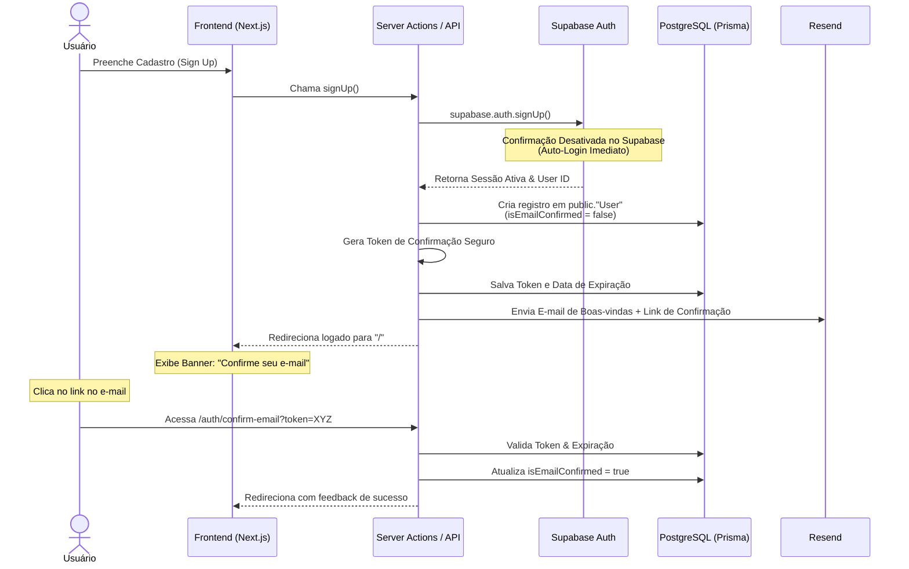

# Plano de Implementação: Confirmação de E-mail Personalizada e Onboarding sem Fricção

Este documento apresenta uma visão geral e um plano de desenvolvimento passo a passo para implementar um fluxo de autenticação e confirmação de e-mail customizado. O objetivo é permitir que o usuário se cadastre e seja logado **imediatamente**, exibindo uma barra superior (banner) para lembrá-lo de confirmar o e-mail, e bloqueando ações críticas (como compras) até que a conta seja confirmada via token.

---

## 🌟 Visão Geral da Abordagem

Por padrão, o Supabase bloqueia o login até que o e-mail seja confirmado (se a confirmação estiver ativa). Para criar uma experiência premium e sem fricção, faremos o seguinte:



### Por que esta abordagem é incrível?
1. **Fricção Zero:** O usuário pode explorar a loja e montar o carrinho de compras imediatamente sem precisar sair do app para abrir a caixa de entrada.
2. **Design e Branding Premium:** Usando o **Resend** (com templates em HTML ou React Email), você tem controle total sobre o design dos seus e-mails, ao invés de usar os e-mails padrões e simples do Supabase.
3. **Segurança Controlada:** Você define exatamente quais partes do sistema exigem confirmação (ex: botão de finalizar compra, alteração de dados de pagamento).

---

## 📂 Resumo das Mudanças Necessárias

1. **Supabase Dashboard:** Desativar a opção "Confirm email" para habilitar o login instantâneo.
2. **Banco de Dados (PostgreSQL / Prisma):**
   - Sincronização automática via SQL Editor (Triggers).
   - Adição dos campos `isEmailConfirmed`, `verificationToken` e `verificationTokenExpires` no modelo `User` do Prisma.
3. **Back-end (Next.js Server Actions & API):**
   - Criação da Server Action para gerar o Token e disparar o e-mail via Resend.
   - Criação da Rota de Confirmação (`/app/[locale]/auth/verify-email/route.ts`).
4. **Front-end:**
   - Banner elegante na barra superior para usuários não confirmados.
   - Validação de segurança em páginas críticas (como a página de checkout).

---

## 🛠️ Passo a Passo da Implementação

### Passo 1: Desativar "Confirm email" no Supabase
Para permitir que o Supabase retorne uma sessão ativa de login imediatamente após o `signUp`, desative a verificação obrigatória padrão:
1. Vá até o seu **Supabase Dashboard**.
2. Navegue até **Authentication** -> **Providers** -> **Email**.
3. Desative a opção **Confirm email** (deixe desmarcado).
4. Salve as alterações.

---

### Passo 2: Sincronização de Login (Supabase Auth -> Banco de Dados)
Como você mencionou que ainda não fez a sincronização, a melhor prática do mercado é criar uma **Trigger** no banco de dados. Isso garante que sempre que um usuário se cadastrar pelo Supabase, o banco de dados PostgreSQL criará automaticamente uma linha correspondente na tabela pública `User`.

Abra o **SQL Editor** no painel do Supabase e execute o seguinte script:

```sql
-- 1. Cria a função que copia o usuário recém-criado para a tabela pública "User"
create or replace function public.handle_new_user()
returns trigger as $$
begin
  insert into public."User" (id, email, "firstName", "lastName", "fullName", "avatarUrl", "isEmailConfirmed")
  values (
    new.id,
    new.email,
    coalesce(new.raw_user_meta_data->>'first_name', ''),
    coalesce(new.raw_user_meta_data->>'last_name', ''),
    coalesce(new.raw_user_meta_data->>'full_name', ''),
    new.raw_user_meta_data->>'avatar_url',
    false -- Começa sempre como não confirmado
  );
  return new;
end;
$$ language plpgsql security definer;

-- 2. Cria o trigger que executa a função acima toda vez que uma linha for inserida em auth.users
create trigger on_auth_user_created
  after insert on auth.users
  for each row execute procedure public.handle_new_user();
```

> [!NOTE]
> Usamos aspas duplas `"User"` porque o Prisma gera os nomes das tabelas respeitando maiúsculas e minúsculas no PostgreSQL.

---

### Passo 3: Atualizar o Prisma Schema
Agora, precisamos adicionar os novos campos ao modelo `User` em seu projeto local.

1. Abra o arquivo `prisma/schema.prisma`.
2. Atualize o modelo `User` para incluir os campos de controle de e-mail e token:

```prisma
model User {
  id                       String    @id @db.Uuid()
  email                    String    @unique @db.VarChar(255)
  firstName                String    @db.VarChar(255)
  lastName                 String    @db.VarChar(255)
  fullName                 String?   @db.VarChar(255)
  avatarUrl                String?   @db.VarChar(255)
  role                     UserRole  @default(CUSTOMER)
  
  // Controle de Confirmação de E-mail
  isEmailConfirmed         Boolean   @default(false)
  verificationToken        String?   @unique @db.VarChar(255)
  verificationTokenExpires DateTime? @db.Timestamp(6)

  createdAt                DateTime  @default(now()) @db.Timestamp(6)
  updatedAt                DateTime  @default(now()) @db.Timestamp(6)
}
```

3. No terminal do projeto, gere uma nova migration para aplicar as mudanças ao seu banco:
   ```bash
   pnpm db:migrate
   ```

---

### Passo 4: Como funcionam os "Tokens"? (Explicação Conceitual)
Um **Token de Confirmação** é uma chave temporária única associada a uma conta.
- **Geração:** Quando o usuário se cadastra, usamos `crypto.randomUUID()` para gerar uma string segura (ex: `e7b957df-dc63-4fb4-9c02-998cbca57d19`).
- **Armazenamento:** Salvamos essa string no campo `verificationToken` e definimos que ela expira em 24 horas (`verificationTokenExpires = agora + 24 horas`).
- **Envio:** Enviamos um link por e-mail: `https://seusite.com/auth/verify-email?token=e7b957df-...`
- **Validação:** Quando o usuário clica no link, nosso backend pega o token da URL, busca no banco se existe algum `User` com esse token e se a data atual é menor que a de expiração. Se for válido, atualizamos `isEmailConfirmed = true` e apagamos o token do banco de dados por segurança.

---

### Passo 5: Gerar Token e Enviar E-mail no Sign Up
Vamos refatorar sua Server Action `signUp` para disparar o e-mail usando **Resend**.

1. Primeiro, instale o SDK da Resend:
   ```bash
   pnpm add resend
   ```
2. Adicione sua chave de API no arquivo `.env`:
   ```env
   RESEND_API_KEY=re_123456789...
   NEXT_PUBLIC_SITE_URL=http://localhost:3000
   ```

3. Crie ou configure um cliente da Resend e atualize seu `signUp` em `src/actions/auth.ts`:

```typescript
"use server";

import { redirect } from "@/i18n/navigation";
import { createClient } from "@/lib/supabase/server";
import { getLocale } from "next-intl/server";
import { PrismaClient } from "@prisma/client"; // ajuste o caminho se usar um client global
import { Resend } from "resend";
import crypto from "crypto";

const prisma = new PrismaClient();
const resend = new Resend(process.env.RESEND_API_KEY);

type SignUpPayload = {
  email: string;
  password: string;
  firstName: string;
  lastName: string;
};

export async function signUp({
  email,
  password,
  firstName,
  lastName,
}: SignUpPayload) {
  const supabase = await createClient();
  const locale = await getLocale();

  // 1. Cadastra no Supabase (com Auto-login ativo)
  const { data: authData, error: authError } = await supabase.auth.signUp({
    email,
    password,
    options: {
      data: {
        first_name: firstName,
        last_name: lastName,
        full_name: `${firstName} ${lastName}`.trim(),
      },
    },
  });

  if (authError || !authData.user) {
    return { error: authError?.code || "Sign up failed" };
  }

  // 2. Gerar Token de Confirmação Seguro
  const token = crypto.randomUUID();
  const expiresAt = new Date();
  expiresAt.setHours(expiresAt.getHours() + 24); // Válido por 24 horas

  // 3. Atualizar no Banco o token do usuário (o usuário já foi inserido pela trigger!)
  await prisma.user.update({
    where: { id: authData.user.id },
    data: {
      verificationToken: token,
      verificationTokenExpires: expiresAt,
    },
  });

  // 4. Enviar E-mail via Resend
  const confirmationLink = `${process.env.NEXT_PUBLIC_SITE_URL}/${locale}/auth/verify-email?token=${token}`;
  
  try {
    await resend.emails.send({
      from: "Minimal E-commerce <no-reply@seu-dominio.com>", // ou use "onboarding@resend.dev" para testes locais
      to: email,
      subject: "Confirme seu E-mail 🚀",
      html: `
        <div style="font-family: sans-serif; max-width: 600px; margin: 0 auto; padding: 20px;">
          <h2>Bem-vindo, ${firstName}! 🎉</h2>
          <p>Obrigado por se cadastrar na nossa loja. Para desbloquear todas as funções e começar a fazer compras, confirme seu e-mail clicando no link abaixo:</p>
          <a href="${confirmationLink}" style="display: inline-block; padding: 12px 24px; background: #000; color: #fff; text-decoration: none; border-radius: 6px; margin: 20px 0;">
            Confirmar meu E-mail
          </a>
          <p>Este link expira em 24 horas.</p>
        </div>
      `,
    });
  } catch (emailError) {
    console.error("Erro ao enviar e-mail de confirmação:", emailError);
    // Não paramos o fluxo caso o email falhe para não quebrar o cadastro do usuário
  }

  // 5. Redireciona logado imediatamente para a home
  redirect({
    href: "/",
    locale: locale,
  });
}
```

---

### Passo 6: Rota para Receber e Validar o Token
Crie uma rota para processar o clique do usuário no e-mail:
`src/app/[locale]/auth/verify-email/route.ts`

```typescript
import { NextRequest, NextResponse } from "next/server";
import { PrismaClient } from "@prisma/client";

const prisma = new PrismaClient();

export async function GET(
  request: NextRequest,
  { params }: { params: Promise<{ locale: string }> }
) {
  const { searchParams } = new URL(request.url);
  const token = searchParams.get("token");
  const { locale } = await params;

  if (!token) {
    return NextResponse.redirect(new URL(`/${locale}/auth/error?reason=no-token`, request.url));
  }

  // 1. Busca usuário com base no token
  const user = await prisma.user.findUnique({
    where: { verificationToken: token },
  });

  if (!user) {
    return NextResponse.redirect(new URL(`/${locale}/auth/error?reason=invalid-token`, request.url));
  }

  // 2. Verifica se expirou
  if (user.verificationTokenExpires && new Date() > user.verificationTokenExpires) {
    return NextResponse.redirect(new URL(`/${locale}/auth/error?reason=expired-token`, request.url));
  }

  // 3. Atualiza estado e limpa tokens
  await prisma.user.update({
    where: { id: user.id },
    data: {
      isEmailConfirmed: true,
      verificationToken: null,
      verificationTokenExpires: null,
    },
  });

  // Redireciona o usuário para a home com um aviso de sucesso
  return NextResponse.redirect(new URL(`/${locale}/?confirmed=true`, request.url));
}
```

---

### Passo 7: Criar a Server Action de Reenvio (Resend Token)
Se o usuário perder o e-mail ou expirar, precisamos deixar que ele solicite outro:
`src/actions/auth.ts` (Adicione no final)

```typescript
export async function resendVerificationEmail(userId: string) {
  const locale = await getLocale();
  
  const user = await prisma.user.findUnique({
    where: { id: userId }
  });

  if (!user || user.isEmailConfirmed) return { success: false };

  const token = crypto.randomUUID();
  const expiresAt = new Date();
  expiresAt.setHours(expiresAt.getHours() + 24);

  await prisma.user.update({
    where: { id: userId },
    data: {
      verificationToken: token,
      verificationTokenExpires: expiresAt
    }
  });

  const confirmationLink = `${process.env.NEXT_PUBLIC_SITE_URL}/${locale}/auth/verify-email?token=${token}`;

  await resend.emails.send({
    from: "Minimal E-commerce <no-reply@seu-dominio.com>",
    to: user.email,
    subject: "Novo Link de Confirmação 🚀",
    html: `<p>Clique <a href="${confirmationLink}">aqui</a> para confirmar seu e-mail.</p>`
  });

  return { success: true };
}
```

---

### Passo 8: Banner do Topbar (`EmailVerificationBanner.tsx`)
Crie um componente premium que aparece apenas se o usuário logado não estiver confirmado.

`src/components/EmailVerificationBanner.tsx`:

```tsx
"use client";

import { useState } from "react";
import { resendVerificationEmail } from "@/actions/auth";
import { AlertTriangle, Loader2, Check } from "lucide-react";

type BannerProps = {
  userId: string;
  userEmail: string;
};

export function EmailVerificationBanner({ userId, userEmail }: BannerProps) {
  const [loading, setLoading] = useState(false);
  const [sent, setSent] = useState(false);

  const handleResend = async () => {
    setLoading(true);
    const res = await resendVerificationEmail(userId);
    setLoading(false);
    if (res.success) {
      setSent(true);
      setTimeout(() => setSent(false), 5000);
    }
  };

  return (
    <div className="bg-amber-500/10 border-b border-amber-500/20 text-amber-900 py-2.5 px-4 text-sm flex flex-col sm:flex-row items-center justify-between gap-2 transition-all duration-300">
      <div className="flex items-center gap-2">
        <AlertTriangle className="h-4 w-4 text-amber-600 flex-shrink-0 animate-bounce" />
        <span>
          Seu e-mail <strong>{userEmail}</strong> não está confirmado. Confirme-o para liberar compras.
        </span>
      </div>
      <button
        onClick={handleResend}
        disabled={loading || sent}
        className="flex items-center gap-1.5 bg-amber-600 text-white font-medium px-3 py-1 rounded-md text-xs hover:bg-amber-700 transition disabled:opacity-50"
      >
        {loading && <Loader2 className="h-3 w-3 animate-spin" />}
        {sent ? (
          <>
            <Check className="h-3 w-3" /> Reenviado! Verifique a Caixa
          </>
        ) : (
          "Reenviar E-mail"
        )}
      </button>
    </div>
  );
}
```

E no seu `src/app/[locale]/layout.tsx`, você pode buscar a sessão do Supabase, consultar o Prisma e renderizar o `<EmailVerificationBanner />` caso o usuário esteja autenticado e `isEmailConfirmed === false`.

---

## 🔒 Protegendo as Compras (Checkout)

Sempre que o usuário tentar fazer checkout, você pode validar se ele está com a conta confirmada:

```typescript
// Exemplo em um Server Action de pagamento ou compra:
const user = await prisma.user.findUnique({ where: { id: sessionUser.id } });

if (!user || !user.isEmailConfirmed) {
  throw new Error("Por favor, confirme seu e-mail antes de realizar compras!");
}
```

---

## 🎯 Próximos Passos Sugeridos
1. **Adquira as chaves do Resend** no site [resend.com](https://resend.com) (a conta padrão é gratuita e você pode enviar e-mails de teste para você mesmo).
2. **Configure o banco de dados** rodando o script SQL de trigger no Supabase Dashboard.
3. **Execute o comando** `pnpm db:migrate` depois de atualizar seu arquivo `schema.prisma`.
4. **Construa as rotas** e divirpa-se estilizando o e-mail de confirmação!

Bons estudos e boa implementação! Se tiver qualquer dúvida em qualquer um dos passos, estou aqui para ajudar você.🚀
